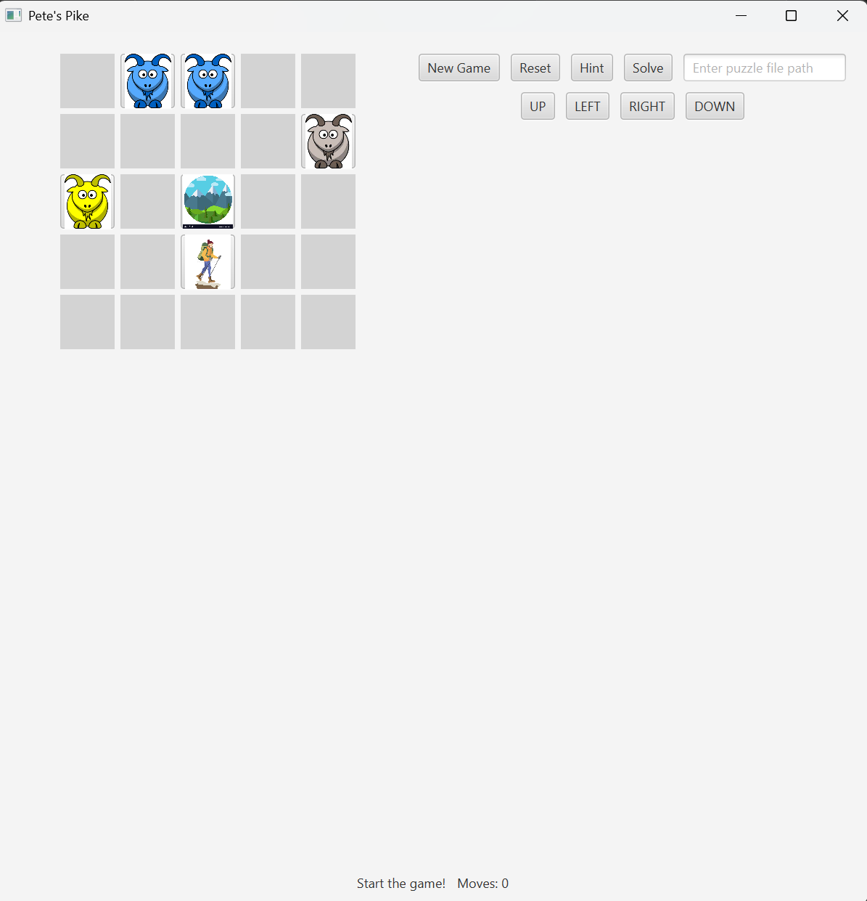
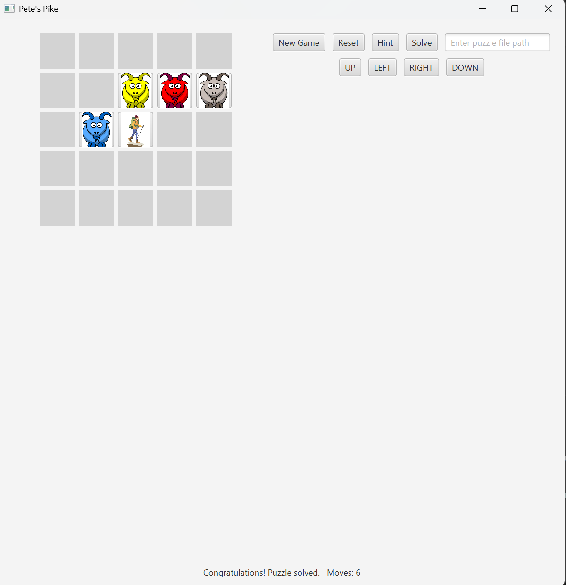
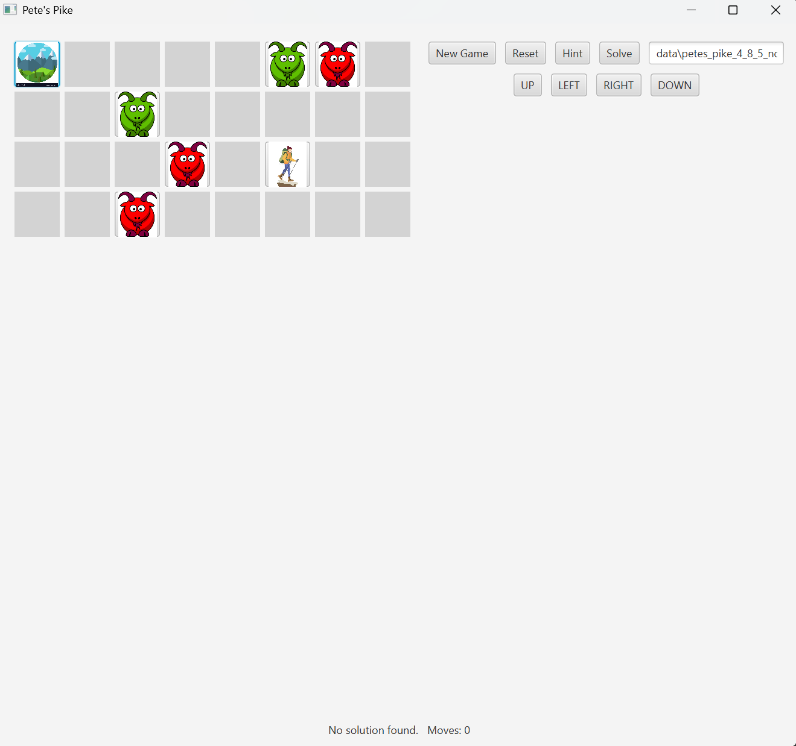

# Pete's Pike Game

A simple puzzle game where Pete navigates goats and obstacles to scale the mountain.  
This project includes a **Command-Line Interface (CLI)**, a **Graphical User Interface (GUI)**, and a **backtracking solver**.

---

## Table of Contents

- [About the Project](#about-the-project)
- [Features](#features)
- [Installation](#installation)
- [Usage](#usage)
- [CLI Commands](#cli-commands)
- [Screenshots](#screenshots)
- [Contributors](#contributors)
- [License](#license)
- [Acknowledgements](#acknowledgements)

---

## About the Project

Pete's Pike is a game where players move Pete across a board to reach the **mountaintop** while navigating goats and avoiding obstacles.  

The project is implemented in **Java** and includes:

- A **CLI** for terminal-based gameplay.
- A **GUI** with animations and visuals using JavaFX.
- A **Solver** that uses a backtracking algorithm to find solutions to the puzzle.

---

## Features

- 🎮 **Interactive Gameplay**: Play using the command-line or graphical interface.
- 💡 **Solver and Hints**: Use hints to make moves or solve the puzzle automatically.
- 🛠️ **Customizable Puzzles**: Load puzzle boards from external text files.
- 🎨 **Visual Feedback**: Color-coded goats and animated movements in the GUI version.

---

## Installation

Follow these steps to set up the project locally:

1. **Clone the Repository**:

   ```bash
   git clone https://github.com/your-username/petes-pike.git
   cd petes-pike
   ```

2. **Compile the Code**:

   ```bash
   javac -d bin src/petespike/**/*.java
   ```

3. **Run the Game**:
   - To launch the **CLI**:

     ```bash
     java -cp bin petespike.view.PetesPikeCLI
     ```

   - To launch the **GUI**:

     ```bash
     java -cp bin petespike.view.PetesPikeGUI
     ```

---

## Usage

### CLI Commands

| **Command**                     | **Description**                                           |
|---------------------------------|-----------------------------------------------------------|
| `board`                         | Display the current game board.                           |
| `move <row> <col> <direction>`  | Move a piece (directions: `u`, `d`, `l`, `r`).            |
| `hint`                          | Display a valid move suggestion.                          |
| `solve`                         | Solve the puzzle automatically.                           |
| `reset`                         | Reset the puzzle to its initial state.                    |
| `new <filename>`                | Start a new puzzle from a file.                           |
| `quit`                          | Exit the game.                                            |

### Example Gameplay

```plaintext
>> board
 0 1 2 3 4 
0 - G G - -
1 - - - - G
2 G - + - - 
3 - - P - -
4 - - - - -
Moves: 0

>> move 0 2 d
 0 1 2 3 4 
0 - G - - -
1 - - G - G
2 G - + - -
3 - - P - -
4 - - - - -
Moves: 1

>> hint
Hint: Move piece at (1, 4) LEFT
```

---

## Screenshots

### **New Game**



### **Solved Game**



### **No Solution**



---

## Contributors

This project was created and developed by:

- **Varun Bharthavarapu**
- **Aman Patel**

---

## License

This project is licensed under the **MIT License**.  
See the [LICENSE](LICENSE) file for more details.

---

## Acknowledgements

Special thanks to our instructors, peers, and open-source communities for their support and resources.
